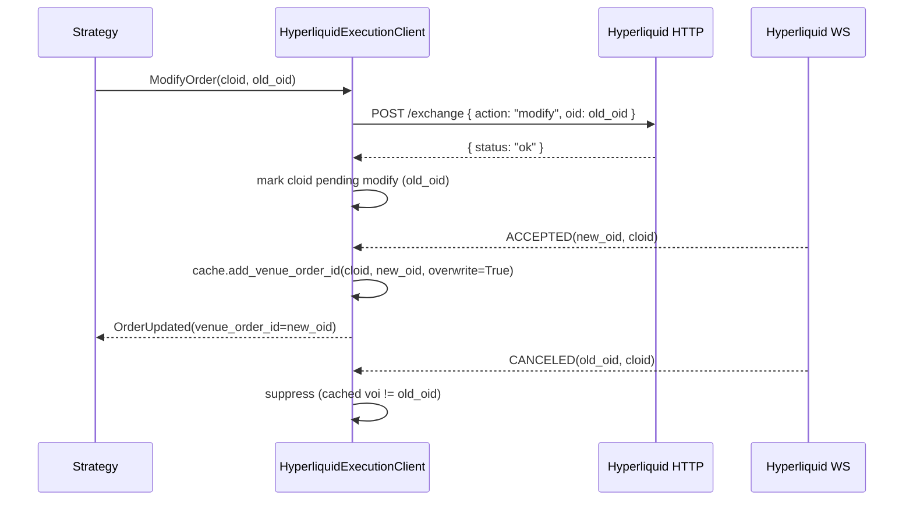

# Hyperliquid

[Hyperliquid](https://hyperliquid.gitbook.io/hyperliquid-docs) is a decentralized perpetual futures
and spot exchange built on the Hyperliquid L1, a purpose-built blockchain optimized for trading.
HyperCore provides a fully on-chain order book and matching engine. This integration supports
live market data ingest and order execution on Hyperliquid.

## Overview

This adapter is implemented in Rust with Python bindings. It provides direct integration
with Hyperliquid's REST and WebSocket APIs without requiring external client libraries.

The Hyperliquid adapter includes multiple components:

- `HyperliquidHttpClient`: Low-level HTTP API connectivity.
- `HyperliquidWebSocketClient`: Low-level WebSocket API connectivity.
- `HyperliquidInstrumentProvider`: Instrument parsing and loading functionality.
- `HyperliquidDataClient`: Market data feed manager.
- `HyperliquidExecutionClient`: Account management and trade execution gateway.
- `HyperliquidLiveDataClientFactory`: Factory for Hyperliquid data clients (used by the trading node builder).
- `HyperliquidLiveExecClientFactory`: Factory for Hyperliquid execution clients (used by the trading node builder).

:::note
Most users will define a configuration for a live trading node (as shown below)
and won't need to work directly with these lower-level components.
:::

## Examples

You can find live example scripts [here](https://github.com/nautechsystems/nautilus_trader/tree/develop/examples/live/hyperliquid/).

## Builder attribution

Orders submitted through the adapter include a NautilusTrader builder address with a zero fee
rate. This is for attribution only and does not charge any additional fees. No builder code
approval is required.

When trading via a vault (`vault_address` configured), the builder address is omitted from
orders. Hyperliquid does not allow vaults to approve builder fees, so including the builder
address would cause the exchange to reject the order.

## Testnet setup

Hyperliquid provides a testnet environment for testing strategies with mock funds.

:::info
**Mainnet account required.** Hyperliquid's testnet faucet only works for wallets that have
previously deposited on mainnet. You must fund a mainnet account first before you can obtain
testnet USDC.
:::

### Getting testnet funds

To receive testnet USDC, you must first have deposited on **mainnet** using the same wallet address:

1. Visit the [Hyperliquid mainnet portal](https://app.hyperliquid.xyz/) and make a deposit with your wallet.
2. Visit the [testnet faucet](https://app.hyperliquid-testnet.xyz/drip) using the same wallet.
3. Claim 1,000 mock USDC from the faucet.

:::note
**Email wallet users**: Email login generates different addresses for mainnet vs testnet.
To use the faucet, export your email wallet from mainnet, import it into MetaMask or Rabby,
then connect the extension to testnet.
:::

### Creating a testnet account

1. Visit the [Hyperliquid testnet portal](https://app.hyperliquid-testnet.xyz/).
2. Connect your wallet (MetaMask, WalletConnect, or email).
3. The testnet automatically creates an account for your wallet address.

### Exporting your private key

To use your testnet account with NautilusTrader, you need to export your wallet's private key:

**MetaMask:**

1. Click the three dots menu next to your account.
2. Select "Account details".
3. Click "Show private key".
4. Enter your password and copy the private key.

:::warning
**Never share your private keys.**
Store private keys securely using environment variables; never commit them to version control.
:::

### Setting environment variables

Set your testnet credentials as environment variables:

```bash
export HYPERLIQUID_TESTNET_PK="your_private_key_here"
# Optional: for vault trading
export HYPERLIQUID_TESTNET_VAULT="vault_address_here"
```

The adapter automatically loads these when `testnet=True` in the configuration.

## Product support

Hyperliquid offers linear perpetual futures, HIP-3 builder-deployed perpetuals, and native
spot markets.

| Product Type      | Data Feed | Trading | Notes                                           |
|-------------------|-----------|---------|-------------------------------------------------|
| Perpetual Futures | ✓         | ✓       | USDC‑settled linear perps (validator‑operated). |
| HIP‑3 Perpetuals  | ✓         | ✓       | Builder‑deployed perps. Excluded by default.    |
| Spot              | ✓         | ✓       | Native spot markets.                            |

:::note
All perpetual futures on Hyperliquid are settled in USDC. Spot markets are standard
currency pairs. See [HIP-3 builder-deployed perpetuals](#hip-3-builder-deployed-perpetuals)
for configuration and opt-in details.
:::

## Symbology

Hyperliquid uses a specific symbol format for instruments:

### Perpetual futures

Format: `{Base}-USD-PERP`

Examples:

- `BTC-USD-PERP` - Bitcoin perpetual futures
- `ETH-USD-PERP` - Ethereum perpetual futures
- `SOL-USD-PERP` - Solana perpetual futures

To subscribe in your strategy:

```python
InstrumentId.from_str("BTC-USD-PERP.HYPERLIQUID")
InstrumentId.from_str("ETH-USD-PERP.HYPERLIQUID")
```

### HIP-3 perpetuals

Format: `{dex}:{Asset}-USD-PERP`

[HIP-3](https://hyperliquid.gitbook.io/hyperliquid-docs/hyperliquid-improvement-proposals-hips/hip-3-builder-deployed-perpetuals)
markets use a dex prefix separated by a colon. The dex name identifies which
builder-deployed perp dex the market belongs to.

Examples:

- `xyz:TSLA-USD-PERP` - Tesla perp on trade.xyz
- `xyz:GOLD-USD-PERP` - Gold perp on trade.xyz
- `flx:NVDA-USD-PERP` - Nvidia perp on Felix
- `vntl:SPACEX-USD-PERP` - SpaceX perp on Ventuals

To subscribe in your strategy:

```python
InstrumentId.from_str("xyz:TSLA-USD-PERP.HYPERLIQUID")
```

### Spot markets

Format: `{Base}-{Quote}-SPOT`

Examples:

- `PURR-USDC-SPOT` - PURR/USDC spot pair
- `HYPE-USDC-SPOT` - HYPE/USDC spot pair

To subscribe in your strategy:

```python
InstrumentId.from_str("PURR-USDC-SPOT.HYPERLIQUID")
```

:::note
Spot instruments may include vault tokens (prefixed with `vntls:`). These are automatically
handled by the instrument provider.
:::

## HIP-3 builder-deployed perpetuals

[HIP-3](https://hyperliquid.gitbook.io/hyperliquid-docs/hyperliquid-improvement-proposals-hips/hip-3-builder-deployed-perpetuals)
allows qualified deployers to launch permissionless perp dexes on Hyperliquid. These markets
include equities (TSLA, NVDA, AAPL), commodities (gold, crude oil), indices (S&P 500), and
pre-IPO tokens (SpaceX, OpenAI).

HIP-3 instruments are excluded by default. To load them, include
`HyperliquidProductType.PERP_HIP3` in the requested product types.

For direct instrument provider usage:

```python
from nautilus_trader.adapters.hyperliquid.enums import HyperliquidProductType
from nautilus_trader.adapters.hyperliquid.providers import HyperliquidInstrumentProvider

provider = HyperliquidInstrumentProvider(
    client=client,
    product_types=[
        HyperliquidProductType.PERP,
        HyperliquidProductType.SPOT,
        HyperliquidProductType.PERP_HIP3,
    ],
)
```

For live `TradingNode` usage, pass the same `product_types` through the Hyperliquid
client config:

```python
from nautilus_trader.adapters.hyperliquid import HyperliquidDataClientConfig
from nautilus_trader.adapters.hyperliquid import HyperliquidExecClientConfig
from nautilus_trader.adapters.hyperliquid import HyperliquidProductType

HyperliquidDataClientConfig(
    product_types=(
        HyperliquidProductType.PERP,
        HyperliquidProductType.PERP_HIP3,
    ),
)

HyperliquidExecClientConfig(
    product_types=(
        HyperliquidProductType.PERP,
        HyperliquidProductType.PERP_HIP3,
    ),
)
```

Once HIP-3 instruments are loaded, you can filter them with `InstrumentProviderConfig`:

```python
instrument_provider=InstrumentProviderConfig(
    load_all=True,
    filters={"market_types": ["perp_hip3"]},
)
```

### Differences from standard perpetuals

HIP-3 markets trade on the same HyperCore matching engine and use the same order API.
The key differences are:

- **Higher fees**: 2x standard perp fees by default. The deployer receives half.
- **Isolated margin**: HIP-3 markets default to isolated-only margin.
- **Deployer-managed oracles**: The deployer operates the oracle feed, not validators.
- **Growth mode**: Some dexes enable growth mode, which reduces protocol fees by 90%.

For full protocol details, see the Hyperliquid docs:

- [HIP-3 proposal](https://hyperliquid.gitbook.io/hyperliquid-docs/hyperliquid-improvement-proposals-hips/hip-3-builder-deployed-perpetuals)
- [HIP-3 deployer actions](https://hyperliquid.gitbook.io/hyperliquid-docs/for-developers/api/hip-3-deployer-actions)
- [Asset IDs](https://hyperliquid.gitbook.io/hyperliquid-docs/for-developers/api/asset-ids)
- [Fees](https://hyperliquid.gitbook.io/hyperliquid-docs/trading/fees)

## Instrument provider

The instrument provider supports filtering when loading instruments via
`InstrumentProviderConfig(filters=...)`:

| Filter key                  | Type        | Description                                 |
|-----------------------------|-------------|---------------------------------------------|
| `market_types` (or `kinds`) | `list[str]` | `"perp"`, `"perp_hip3"`, or `"spot"`.       |
| `bases`                     | `list[str]` | Base currency codes, e.g. `["BTC", "ETH"]`. |
| `quotes`                    | `list[str]` | Quote currency codes, e.g. `["USDC"]`.      |
| `symbols`                   | `list[str]` | Full symbols, e.g. `["BTC-USD-PERP"]`.      |

Example loading only perpetual instruments:

```python
instrument_provider=InstrumentProviderConfig(
    load_all=True,
    filters={"market_types": ["perp"]},
)
```

## Data subscriptions

The adapter supports the following data subscriptions. All perpetual data types
(mark prices, index prices, funding rates) apply to both standard and HIP-3 perps.

| Data type         | Subscription | Snapshot | Historical | Nautilus type        | Notes                                      |
|-------------------|--------------|----------|------------|----------------------|--------------------------------------------|
| Trade ticks       | ✓            | -        | -          | `TradeTick`          | Via WebSocket trades channel.              |
| Quote ticks       | ✓            | -        | -          | `QuoteTick`          | Best bid/offer from WebSocket.             |
| Order book deltas | ✓            | ✓        | -          | `OrderBookDelta`     | L2 depth. Each message is a full snapshot. |
| Bars              | ✓            | -        | ✓          | `Bar`                | See supported intervals below.             |
| Mark prices       | ✓            | -        | -          | `MarkPriceUpdate`    | Perpetual mark price ticks.                |
| Index prices      | ✓            | -        | -          | `IndexPriceUpdate`   | Underlying index reference prices.         |
| Funding rates     | ✓            | -        | -          | `FundingRateUpdate`  | Perpetual funding rate updates.            |

:::note
Historical quote tick and trade tick requests are not yet supported by this adapter.
:::

### Supported bar intervals

| Resolution | Hyperliquid candle |
|------------|--------------------|
| 1-MINUTE   | `1m`               |
| 3-MINUTE   | `3m`               |
| 5-MINUTE   | `5m`               |
| 15-MINUTE  | `15m`              |
| 30-MINUTE  | `30m`              |
| 1-HOUR     | `1h`               |
| 2-HOUR     | `2h`               |
| 4-HOUR     | `4h`               |
| 8-HOUR     | `8h`               |
| 12-HOUR    | `12h`              |
| 1-DAY      | `1d`               |
| 3-DAY      | `3d`               |
| 1-WEEK     | `1w`               |
| 1-MONTH    | `1M`               |

## Orders capability

Hyperliquid supports a full set of order types and execution options.

:::note
In the tables below, "Perpetuals" covers both standard validator-operated perps and
HIP-3 builder-deployed perps. The same order types, time-in-force options, and execution
instructions apply to both.
:::

### Order types

| Order Type          | Perpetuals | Spot | Notes                                     |
|---------------------|------------|------|-------------------------------------------|
| `MARKET`            | ✓          | ✓    | IOC limit at 0.5% slippage from best BBO. |
| `LIMIT`             | ✓          | ✓    |                                           |
| `STOP_MARKET`       | ✓          | ✓    | Stop loss orders.                         |
| `STOP_LIMIT`        | ✓          | ✓    | Stop loss with limit execution.           |
| `MARKET_IF_TOUCHED` | ✓          | ✓    | Take profit at market.                    |
| `LIMIT_IF_TOUCHED`  | ✓          | ✓    | Take profit with limit execution.         |

:::info
Conditional orders (stop and if-touched) are implemented using Hyperliquid's native trigger
order functionality with automatic TP/SL mode detection. All trigger orders are evaluated
against the [mark price](https://hyperliquid.gitbook.io/hyperliquid-docs/trading/robust-price-indices).
:::

:::note
Market orders require cached quote data. The adapter uses the best ask (for buys) or best bid
(for sells) with 0.5% slippage. Prices are rounded to 5 significant figures, which is a
Hyperliquid API requirement for all limit prices. Ensure you subscribe to quotes for any
instrument you intend to trade with market orders.
:::

:::note
`STOP_MARKET` and `MARKET_IF_TOUCHED` orders do not carry a limit price. The adapter derives
one from the trigger price with 0.5% slippage, rounds to 5 significant figures, and clamps to
the instrument's price precision (ceiling for buys, floor for sells). This guarantees
Hyperliquid's `limit_px >= trigger_px` (buys) / `limit_px <= trigger_px` (sells) constraint.
:::

:::warning
**Price normalization is enabled by default.** Hyperliquid enforces a maximum of 5 significant
figures on all order prices. This is a dynamic constraint that depends on the price magnitude
and cannot be fully encoded in the static instrument price precision. For example, if ETH is
trading at $2,600 (4 integer digits), only 1 decimal place is allowed despite the instrument
having `price_precision=2`.

By default, the adapter normalizes all outgoing limit and trigger prices to 5 significant
figures to prevent order rejections. This means your submitted prices may shift slightly.
To disable this and take full control of price formatting, set `normalize_prices=False`
in your `HyperliquidExecClientConfig`.

If you disable normalization, you can apply the same rounding in your strategy:

```python
from decimal import Decimal, ROUND_DOWN

def round_to_sig_figs(price: Decimal, sig_figs: int = 5) -> Decimal:
    if price == 0:
        return Decimal(0)
    shift = sig_figs - int(price.adjusted()) - 1
    if shift <= 0:
        factor = Decimal(10) ** (-shift)
        return (price / factor).to_integral_value() * factor
    return round(price, shift)
```

:::

### Time in force

| Time in force | Perpetuals | Spot | Notes                |
|---------------|------------|------|----------------------|
| `GTC`         | ✓          | ✓    | Good Till Canceled.  |
| `IOC`         | ✓          | ✓    | Immediate or Cancel. |
| `FOK`         | -          | -    | *Not supported*.     |
| `GTD`         | -          | -    | *Not supported*.     |

### Execution instructions

| Instruction   | Perpetuals | Spot | Notes                            |
|---------------|------------|------|----------------------------------|
| `post_only`   | ✓          | ✓    | Equivalent to ALO time in force. |
| `reduce_only` | ✓          | ✓    | Close‑only orders.               |

:::info
Post-only orders that would immediately match are rejected by Hyperliquid. The adapter detects
this and generates an `OrderRejected` event. Post-only orders are routed through Hyperliquid's
ALO (Add-Liquidity-Only) lane.
:::

### Order operations

| Operation         | Perpetuals | Spot | Notes                                           |
|-------------------|------------|------|-------------------------------------------------|
| Submit order      | ✓          | ✓    | Single order submission.                        |
| Submit order list | ✓          | ✓    | Batch order submission (single API call).       |
| Modify order      | ✓          | ✓    | Requires venue order ID.                        |
| Cancel order      | ✓          | ✓    | Cancel by client order ID.                      |
| Cancel all orders | ✓          | ✓    | Iterates cached open orders by instrument/side. |
| Batch cancel      | ✓          | ✓    | Iterates provided cancel list.                  |

:::warning
Cancel all and batch cancel issue individual cancel requests per order.
:::

:::info
Orders placed outside NautilusTrader (e.g. via the Hyperliquid web UI or another client)
are detected and tracked as external orders. They appear in order status reports and position
reconciliation.
:::

### Modify as cancel-replace

Hyperliquid implements order modification as a **cancel-replace**. The `modify` action on the
[exchange endpoint](https://hyperliquid.gitbook.io/hyperliquid-docs/for-developers/api/exchange-endpoint#modify-an-order)
cancels the original order (old `oid`) and opens a replacement with a new `oid`. Both legs
share the same client order ID (`cloid`).

The modify HTTP response only confirms success. The
[`orderUpdates` WebSocket subscription](https://hyperliquid.gitbook.io/hyperliquid-docs/for-developers/api/websocket/subscriptions)
then delivers an `ACCEPTED(new_oid)` status report, followed by a `CANCELED(old_oid)` for the
original leg.

The adapter detects the replacement leg by comparing the report's `venue_order_id` against the
cached `venue_order_id` for the `cloid`. When they differ, the adapter overwrites the cache and
emits a single `OrderUpdated` event to the strategy:



If Hyperliquid delivers `CANCELED(old_oid)` before `ACCEPTED(new_oid)` for an in-flight modify,
the pending-modify marker lets the adapter drop the old leg's cancel and still route the
subsequent `ACCEPTED` through the `OrderUpdated` path. The marker is only set after a confirmed
HTTP success, so a failed modify never leaves stale race state. Because detection otherwise
relies on the cached `venue_order_id`, the adapter also recovers a modify that times out on the
HTTP call but still reaches the venue: the eventual WS `ACCEPTED(new_oid)` sees the old cached
`oid` and translates to `OrderUpdated`. See [GH-3827](https://github.com/nautechsystems/nautilus_trader/issues/3827).

:::note
One narrow edge case remains when all three conditions occur together:

1. The modify HTTP call raises (transport timeout or connection error).
2. Hyperliquid still processes the modify on the exchange side.
3. Hyperliquid delivers `CANCELED(old_oid)` before `ACCEPTED(new_oid)` on the WebSocket.

Under (1) the pending-modify marker is not installed, so the early `CANCELED(old_oid)` emits as
`OrderCanceled` before the replacement `ACCEPTED(new_oid)` arrives. The periodic reconciliation
cycle restores the correct order state against the exchange.
:::

## Order books

Order books are maintained via L2 WebSocket subscription. Each message delivers a full-depth
snapshot (clear + rebuild), not incremental deltas.

:::note
There is a limitation of one order book per instrument per trader instance.
:::

## Account and position management

The adapter reports account state with USDC balances and margin usage. Standard perps
default to cross margin. HIP-3 perps typically require isolated margin. On connect,
the execution client performs a full reconciliation of orders, fills, and positions
against Hyperliquid's clearinghouse state. This keeps the local cache consistent
even after restarts or disconnections.

:::note
Leverage is managed directly through the Hyperliquid web UI or API, not through the adapter.
Set your desired leverage per instrument on Hyperliquid before trading.
:::

## Connection management

The adapter automatically reconnects on WebSocket disconnection using exponential backoff
(starting at 250ms, up to 5s). On reconnect, all active subscriptions are resubscribed
automatically, and order book snapshots are rebuilt. No manual intervention is required.

A heartbeat ping is sent every 30 seconds to keep the connection alive (Hyperliquid closes
idle connections after 60 seconds).

## API credentials

There are two options for supplying your credentials to the Hyperliquid clients.
Either pass the corresponding values to the configuration objects, or
set the following environment variables:

For Hyperliquid mainnet clients, you can set:

- `HYPERLIQUID_PK`
- `HYPERLIQUID_VAULT` (optional, for vault trading)
- `HYPERLIQUID_ACCOUNT_ADDRESS` (optional, for agent wallet trading)

For Hyperliquid testnet clients, you can set:

- `HYPERLIQUID_TESTNET_PK`
- `HYPERLIQUID_TESTNET_VAULT` (optional, for vault trading)

:::tip
We recommend using environment variables to manage your credentials.
:::

## Vault trading

Hyperliquid supports [vault trading](https://hyperliquid.gitbook.io/hyperliquid-docs/trading/vaults),
where a wallet operates on behalf of a vault (sub-account). Orders are signed with the
wallet's private key but include the vault address in the signature payload.

To trade via a vault, set the `vault_address` in your execution client config (or set the
`HYPERLIQUID_VAULT` / `HYPERLIQUID_TESTNET_VAULT` environment variable).

:::warning
When vault trading is enabled, WebSocket subscriptions for order and fill updates automatically
use the vault address instead of the wallet address. This is required to receive the vault's
order and fill events.
:::

## Funding rates

Hyperliquid perpetual futures use a fixed 1-hour funding interval. The adapter sets
`interval` to `60` (minutes) on all `FundingRateUpdate` objects.

## Rate limiting

The adapter implements a token bucket rate limiter for Hyperliquid's REST API with a capacity
of 1200 weight per minute. HTTP info requests are automatically retried with exponential
backoff (full jitter) on rate limit (429) and server error (5xx) responses.

## Configuration

### Data client configuration options

| Option              | Default | Description                                     |
|---------------------|---------|-------------------------------------------------|
| `base_url_ws`       | `None`  | Override for the WebSocket base URL.            |
| `testnet`           | `False` | Connect to the Hyperliquid testnet when `True`. |
| `product_types`     | `None`  | Optional product types to load, for example `PERP_HIP3` for HIP-3 perps. |
| `http_timeout_secs` | `10`    | Timeout (seconds) applied to REST calls.        |
| `http_proxy_url`    | `None`  | Optional HTTP proxy URL.                        |
| `ws_proxy_url`      | `None`  | Reserved; WebSocket proxy not yet implemented.  |

### Execution client configuration options

| Option                   | Default | Description                                                                               |
|--------------------------|---------|-------------------------------------------------------------------------------------------|
| `private_key`            | `None`  | EVM private key; loaded from `HYPERLIQUID_PK` or `HYPERLIQUID_TESTNET_PK` when omitted.   |
| `vault_address`          | `None`  | Vault address; loaded from `HYPERLIQUID_VAULT` or `HYPERLIQUID_TESTNET_VAULT` if omitted. |
| `account_address`        | `None`  | Main account address for agent wallet trading; loaded from `HYPERLIQUID_ACCOUNT_ADDRESS`. |
| `base_url_ws`            | `None`  | Override for the WebSocket base URL.                                                      |
| `testnet`                | `False` | Connect to the Hyperliquid testnet when `True`.                                           |
| `product_types`          | `None`  | Optional product types to load, for example `PERP_HIP3` for HIP-3 perps.                  |
| `max_retries`            | `None`  | Maximum retry attempts for submit, cancel, or modify order requests.                      |
| `retry_delay_initial_ms` | `None`  | Initial delay (milliseconds) between retries.                                             |
| `retry_delay_max_ms`     | `None`  | Maximum delay (milliseconds) between retries.                                             |
| `http_timeout_secs`      | `10`    | Timeout (seconds) applied to REST calls.                                                  |
| `normalize_prices`       | `True`  | Normalize order prices to 5 significant figures before submission.                        |
| `http_proxy_url`         | `None`  | Optional HTTP proxy URL.                                                                  |
| `ws_proxy_url`           | `None`  | Reserved; WebSocket proxy not yet implemented.                                            |

### Configuration example

```python
from nautilus_trader.adapters.hyperliquid import HYPERLIQUID
from nautilus_trader.adapters.hyperliquid import HyperliquidDataClientConfig
from nautilus_trader.adapters.hyperliquid import HyperliquidExecClientConfig
from nautilus_trader.adapters.hyperliquid import HyperliquidProductType
from nautilus_trader.config import InstrumentProviderConfig
from nautilus_trader.config import TradingNodeConfig

config = TradingNodeConfig(
    data_clients={
        HYPERLIQUID: HyperliquidDataClientConfig(
            instrument_provider=InstrumentProviderConfig(load_all=True),
            product_types=(
                HyperliquidProductType.PERP,
                HyperliquidProductType.PERP_HIP3,
            ),
            testnet=True,  # Use testnet
        ),
    },
    exec_clients={
        HYPERLIQUID: HyperliquidExecClientConfig(
            private_key=None,  # Loads from HYPERLIQUID_TESTNET_PK env var
            vault_address=None,  # Optional: loads from HYPERLIQUID_TESTNET_VAULT
            instrument_provider=InstrumentProviderConfig(load_all=True),
            product_types=(
                HyperliquidProductType.PERP,
                HyperliquidProductType.PERP_HIP3,
            ),
            testnet=True,  # Use testnet
            normalize_prices=True,  # Rounds prices to 5 significant figures
        ),
    },
)
```

:::note
When `testnet=True`, the adapter automatically uses testnet environment variables
(`HYPERLIQUID_TESTNET_PK` and `HYPERLIQUID_TESTNET_VAULT`) instead of mainnet variables.
:::

Then, create a `TradingNode` and add the client factories:

```python
from nautilus_trader.adapters.hyperliquid import HYPERLIQUID
from nautilus_trader.adapters.hyperliquid import HyperliquidLiveDataClientFactory
from nautilus_trader.adapters.hyperliquid import HyperliquidLiveExecClientFactory
from nautilus_trader.live.node import TradingNode

# Instantiate the live trading node with a configuration
node = TradingNode(config=config)

# Register the client factories with the node
node.add_data_client_factory(HYPERLIQUID, HyperliquidLiveDataClientFactory)
node.add_exec_client_factory(HYPERLIQUID, HyperliquidLiveExecClientFactory)

# Finally build the node
node.build()
```

## Contributing

:::info
For additional features or to contribute to the Hyperliquid adapter, please see our
[contributing guide](https://github.com/nautechsystems/nautilus_trader/blob/develop/CONTRIBUTING.md).
:::
